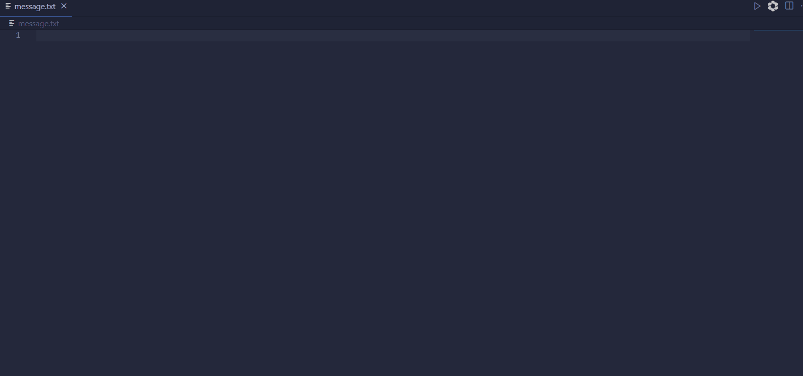

# Golang Flutter App FFI

This repo demonstrates a very simple `Flutter` app with `Golang` used as backend lanugage, communicating using `FFI (Foreign Function Interface)`,
the app is a very simple note taking app that currently allows you to whip up a message and save it into a `message.txt` file.

## Example



## Prerequisites

- `go`
- `make`
- `flutter sdk` version `2.16.2^`

## Usage

Try it out:

```bash
$ make run

# Overrite FLUTTER_DEVICE to change the flutter device build option
# WARNNING: may not work with certain devices
$ make run FLUTTER_DEVICE=chrome
```

You can use this project as boilerplate for `Golang` + `Flutter` - `FFI Communitation`

## Project Structure

- lib
  - main.dart
  - create_message.dart
- vendor
  - text.go
  - go.mod
- vendor-out (tmp)
  - text.a
  - text.h

`lib` - flutter code files

`create_message.dart` - Golang logic using FFI to Dart

`vendor` - Golang files as backend

`vendor-out` - Golang compiled files

## License

[MIT](LICENSE).
